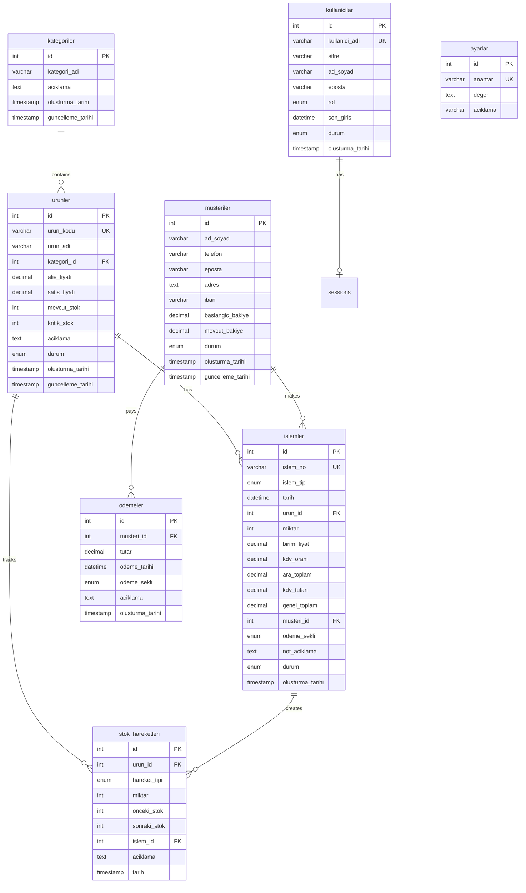
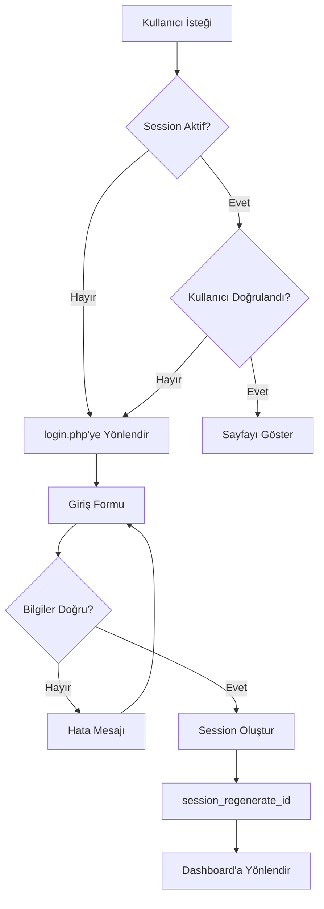

# 📦 Cemil Çalışkan Stok Takip Sistemi - Kapsamlı Teknik Dokümantasyon

> **Versiyon:** 1.0.0  
> **Tarih:** Şubat 2026  
> **Geliştirici:** Cemil Çalışkan için Özel Geliştirme  
> **Platform:** PHP 7.4+ / MySQL / Bootstrap 5

---

## 📑 İçindekiler

1. [Proje Genel Bakış](#1-proje-genel-bakış)
2. [Sistem Gereksinimleri](#2-sistem-gereksinimleri)
3. [Dosya ve Klasör Yapısı](#3-dosya-ve-klasör-yapısı)
4. [Veritabanı Yapısı](#4-veritabanı-yapısı)
5. [Kimlik Doğrulama Sistemi](#5-kimlik-doğrulama-sistemi)
6. [Sayfa Modülleri](#6-sayfa-modülleri)
7. [API Endpoints](#7-api-endpoints)
8. [Frontend Teknolojileri](#8-frontend-teknolojileri)
9. [CSS Tasarım Sistemi](#9-css-tasarım-sistemi)
10. [JavaScript Fonksiyonları](#10-javascript-fonksiyonları)
11. [Güvenlik Önlemleri](#11-güvenlik-önlemleri)
12. [Kurulum Kılavuzu](#12-kurulum-kılavuzu)
13. [Kullanım Kılavuzu](#13-kullanım-kılavuzu)

---

## 1. Proje Genel Bakış

### 1.1 Amaç
Bu proje, **Cemil Çalışkan** için özel olarak geliştirilmiş, modern ve kullanıcı dostu bir **PHP tabanlı stok takip uygulamasıdır**. Ürün yönetimi, müşteri ilişkileri, satış/alış işlemleri, borç/alacak takibi ve detaylı raporlama özelliklerini tek bir platformda birleştirir.

### 1.2 Temel Özellikler

| Modül | Özellikler |
|-------|-----------|
| **Dashboard** | Toplam ürün/müşteri sayıları, stok değeri, borç/alacak özeti, günlük/aylık satışlar, düşük stok uyarıları, satış grafikleri |
| **Ürün Yönetimi** | CRUD işlemleri, kategori atama, alış/satış fiyatları, kritik stok seviyesi, arama ve filtreleme |
| **Müşteri Yönetimi** | CRUD işlemleri, borç/alacak takibi, ödeme alma, bakiye düzeltme, işlem geçmişi |
| **İşlem Yönetimi** | Satış/alış kayıtları, otomatik stok güncelleme, KDV hesaplama, ödeme şekilleri |
| **Raporlar** | Satış/alış özetleri, kar marjı, KDV raporları, en çok satanlar, PDF export |
| **Ayarlar** | Firma bilgileri, şifre değiştirme, veritabanı yedekleme |

### 1.3 Teknoloji Stack'i

```
┌─────────────────────────────────────────────────────────────────┐
│                        FRONTEND                                  │
├─────────────────────────────────────────────────────────────────┤
│  HTML5 │ CSS3 │ Bootstrap 5 │ JavaScript │ jQuery 3.7.1         │
│  DataTables │ Select2 │ Chart.js │ SweetAlert2 │ Bootstrap Icons│
└─────────────────────────────────────────────────────────────────┘
                              │
                              ▼
┌─────────────────────────────────────────────────────────────────┐
│                        BACKEND                                   │
├─────────────────────────────────────────────────────────────────┤
│  PHP 7.4+ │ PDO (MySQL) │ Session Management │ RESTful API      │
└─────────────────────────────────────────────────────────────────┘
                              │
                              ▼
┌─────────────────────────────────────────────────────────────────┐
│                        DATABASE                                  │
├─────────────────────────────────────────────────────────────────┤
│  MySQL 5.7+ │ InnoDB Engine │ utf8mb4_turkish_ci Collation      │
└─────────────────────────────────────────────────────────────────┘
```

---

## 2. Sistem Gereksinimleri

### 2.1 Sunucu Gereksinimleri

| Bileşen | Minimum Versiyon | Önerilen |
|---------|------------------|----------|
| PHP | 7.4 | 8.0+ |
| MySQL | 5.7 | 8.0+ |
| Apache/Nginx | 2.4+ | Son sürüm |
| PDO Extension | Gerekli | - |

### 2.2 PHP Eklentileri
- `pdo_mysql` - MySQL PDO sürücüsü
- `mbstring` - Multi-byte string desteği
- `json` - JSON işlemleri
- `session` - Oturum yönetimi

### 2.3 Tarayıcı Desteği
- Chrome 90+
- Firefox 88+
- Safari 14+
- Edge 90+

---

## 3. Dosya ve Klasör Yapısı

```
c:\xampp\htdocs\
│
├── 📁 api/                          # RESTful API Endpoints
│   ├── customers.php                # Müşteri API (GET, POST, PUT, DELETE)
│   ├── products.php                 # Ürün API (GET, POST, PUT, DELETE)
│   └── transactions.php             # İşlem API (GET, POST, DELETE)
│
├── 📁 assets/                       # Statik Dosyalar
│   ├── 📁 css/
│   │   └── style.css               # Ana CSS dosyası (839 satır)
│   └── 📁 js/
│       └── main.js                 # Ana JavaScript dosyası (312 satır)
│
├── 📁 config/                       # Yapılandırma Dosyaları
│   └── database.php                # Veritabanı bağlantısı & yardımcı fonksiyonlar
│
├── 📁 includes/                     # Dahil Edilen Dosyalar
│   ├── auth.php                    # Kimlik doğrulama kontrolü
│   ├── header.php                  # Sayfa başlığı, sidebar, navbar
│   └── footer.php                  # Sayfa sonu, script yüklemeleri
│
├── 📁 pages/                        # Ek sayfalar (şu an boş)
│
├── ayarlar.php                      # Sistem ayarları sayfası
├── database.sql                     # Veritabanı şeması
├── index.php                        # Dashboard (ana sayfa)
├── islemler.php                     # İşlemler sayfası
├── kategoriler.php                  # Kategori yönetimi
├── login.php                        # Giriş sayfası
├── logout.php                       # Çıkış işlemi
├── musteriler.php                   # Müşteri yönetimi
├── raporlar.php                     # Raporlar sayfası
├── setup.php                        # Kurulum scripti
├── urunler.php                      # Ürün yönetimi
└── README.md                        # Proje açıklaması
```

---

## 4. Veritabanı Yapısı

### 4.1 Entity-Relationship Diyagramı



### 4.2 Tablo Detayları

#### 4.2.1 `kategoriler` - Ürün Kategorileri
| Kolon | Tip | Açıklama |
|-------|-----|----------|
| `id` | INT AUTO_INCREMENT | Primary Key |
| `kategori_adi` | VARCHAR(100) | Kategori adı |
| `aciklama` | TEXT | Açıklama |
| `olusturma_tarihi` | TIMESTAMP | Oluşturma zamanı |
| `guncelleme_tarihi` | TIMESTAMP | Güncelleme zamanı |

#### 4.2.2 `urunler` - Ürün Bilgileri
| Kolon | Tip | Açıklama |
|-------|-----|----------|
| `id` | INT AUTO_INCREMENT | Primary Key |
| `urun_kodu` | VARCHAR(50) UNIQUE | Benzersiz ürün kodu |
| `urun_adi` | VARCHAR(255) | Ürün adı |
| `kategori_id` | INT | Foreign Key → kategoriler.id |
| `alis_fiyati` | DECIMAL(10,2) | Alış fiyatı |
| `satis_fiyati` | DECIMAL(10,2) | Satış fiyatı |
| `mevcut_stok` | INT | Mevcut stok miktarı |
| `kritik_stok` | INT | Kritik stok seviyesi (varsayılan: 10) |
| `aciklama` | TEXT | Ürün açıklaması |
| `durum` | ENUM('aktif','pasif') | Ürün durumu |

#### 4.2.3 `musteriler` - Müşteri Bilgileri
| Kolon | Tip | Açıklama |
|-------|-----|----------|
| `id` | INT AUTO_INCREMENT | Primary Key |
| `ad_soyad` | VARCHAR(255) | Müşteri adı soyadı |
| `telefon` | VARCHAR(20) | Telefon numarası |
| `eposta` | VARCHAR(255) | E-posta adresi |
| `adres` | TEXT | Adres |
| `iban` | VARCHAR(50) | Banka IBAN numarası |
| `baslangic_bakiye` | DECIMAL(10,2) | Başlangıç bakiyesi |
| `mevcut_bakiye` | DECIMAL(10,2) | Mevcut bakiye (+borç, -alacak) |
| `durum` | ENUM('aktif','pasif') | Müşteri durumu |

#### 4.2.4 `islemler` - Satış/Alış İşlemleri
| Kolon | Tip | Açıklama |
|-------|-----|----------|
| `id` | INT AUTO_INCREMENT | Primary Key |
| `islem_no` | VARCHAR(50) UNIQUE | Benzersiz işlem numarası |
| `islem_tipi` | ENUM('alis','satis') | İşlem türü |
| `tarih` | DATETIME | İşlem tarihi ve saati |
| `urun_id` | INT | Foreign Key → urunler.id |
| `miktar` | INT | İşlem miktarı |
| `birim_fiyat` | DECIMAL(10,2) | Birim fiyat (KDV hariç) |
| `kdv_orani` | DECIMAL(5,2) | KDV oranı (%) |
| `ara_toplam` | DECIMAL(10,2) | Ara toplam (KDV hariç) |
| `kdv_tutari` | DECIMAL(10,2) | KDV tutarı |
| `genel_toplam` | DECIMAL(10,2) | Genel toplam (KDV dahil) |
| `musteri_id` | INT | Foreign Key → musteriler.id (opsiyonel) |
| `odeme_sekli` | ENUM(...) | nakit, kredi_karti, havale, cek, vadeli |
| `not_aciklama` | TEXT | İşlem notu |
| `durum` | ENUM(...) | tamamlandi, beklemede, iptal |

#### 4.2.5 `odemeler` - Müşteri Ödemeleri
| Kolon | Tip | Açıklama |
|-------|-----|----------|
| `id` | INT AUTO_INCREMENT | Primary Key |
| `musteri_id` | INT | Foreign Key → musteriler.id |
| `tutar` | DECIMAL(10,2) | Ödeme tutarı |
| `odeme_tarihi` | DATETIME | Ödeme tarihi |
| `odeme_sekli` | ENUM(...) | Ödeme şekli |
| `aciklama` | TEXT | Açıklama |

#### 4.2.6 `stok_hareketleri` - Stok Takibi
| Kolon | Tip | Açıklama |
|-------|-----|----------|
| `id` | INT AUTO_INCREMENT | Primary Key |
| `urun_id` | INT | Foreign Key → urunler.id |
| `hareket_tipi` | ENUM('giris','cikis','duzeltme') | Hareket türü |
| `miktar` | INT | Hareket miktarı |
| `onceki_stok` | INT | Önceki stok değeri |
| `sonraki_stok` | INT | Sonraki stok değeri |
| `islem_id` | INT | Foreign Key → islemler.id |
| `aciklama` | TEXT | Açıklama |

#### 4.2.7 `ayarlar` - Sistem Ayarları
| Kolon | Tip | Açıklama |
|-------|-----|----------|
| `id` | INT AUTO_INCREMENT | Primary Key |
| `anahtar` | VARCHAR(100) UNIQUE | Ayar anahtarı |
| `deger` | TEXT | Ayar değeri |
| `aciklama` | VARCHAR(255) | Açıklama |

**Varsayılan Ayarlar:**
- `firma_adi`: "Cemil Çalışkan"
- `kdv_orani`: "18"
- `para_birimi`: "₺"
- `kritik_stok_varsayilan`: "10"

#### 4.2.8 `kullanicilar` - Kullanıcı Yönetimi
| Kolon | Tip | Açıklama |
|-------|-----|----------|
| `id` | INT AUTO_INCREMENT | Primary Key |
| `kullanici_adi` | VARCHAR(50) UNIQUE | Kullanıcı adı |
| `sifre` | VARCHAR(255) | Hashlenmiş şifre (bcrypt) |
| `ad_soyad` | VARCHAR(100) | Ad soyad |
| `eposta` | VARCHAR(255) | E-posta |
| `rol` | ENUM('admin','kullanici') | Kullanıcı rolü |
| `son_giris` | DATETIME | Son giriş zamanı |
| `durum` | ENUM('aktif','pasif') | Kullanıcı durumu |

**Varsayılan Admin:**
- Kullanıcı Adı: `admin`
- Şifre: `admin123`

### 4.3 Veritabanı İndeksleri

```sql
CREATE INDEX idx_urunler_kod ON urunler(urun_kodu);
CREATE INDEX idx_urunler_kategori ON urunler(kategori_id);
CREATE INDEX idx_musteriler_telefon ON musteriler(telefon);
CREATE INDEX idx_islemler_tarih ON islemler(tarih);
CREATE INDEX idx_islemler_tip ON islemler(islem_tipi);
CREATE INDEX idx_islemler_musteri ON islemler(musteri_id);
```

---

## 5. Kimlik Doğrulama Sistemi

### 5.1 Akış Diyagramı



### 5.2 Dosyalar ve İşlevleri

#### 5.2.1 `login.php` - Giriş Sayfası
```php
// Ana özellikler:
- Session başlatma
- Cache önleme headers
- Zaten giriş yapıldıysa dashboard'a yönlendirme
- Kullanıcı adı/şifre doğrulama
- password_verify() ile güvenli şifre kontrolü
- session_regenerate_id() ile session fixation koruması
- Son giriş tarihini güncelleme
```

#### 5.2.2 `includes/auth.php` - Kimlik Kontrolü
```php
// Her sayfa başında dahil edilir
// İşlevler:
- Cache önleme headers
- Session kontrolü ($_SESSION['user_id'])
- Giriş yapılmamışsa login.php'ye yönlendirme
- $currentUser dizisi oluşturma
- isAdmin() fonksiyonu
- getCurrentUserName() fonksiyonu
```

#### 5.2.3 `logout.php` - Çıkış İşlemi
```php
// Güvenli çıkış prosedürü:
1. Session değişkenlerini temizle
2. Session cookie'sini sil
3. Session'ı yok et
4. Yeni session başlat ve hemen yok et
5. Cache temizleme headers
6. login.php'ye yönlendir
```

### 5.3 Session Değişkenleri

| Değişken | Tip | Açıklama |
|----------|-----|----------|
| `$_SESSION['user_id']` | int | Kullanıcı ID |
| `$_SESSION['username']` | string | Kullanıcı adı |
| `$_SESSION['user_name']` | string | Ad soyad |
| `$_SESSION['user_role']` | string | "admin" veya "kullanici" |
| `$_SESSION['login_time']` | int | Giriş timestamp |

---

## 6. Sayfa Modülleri

### 6.1 Dashboard (`index.php`)

#### İşlevler:
- **İstatistik Kartları:**
  - Toplam ürün sayısı
  - Toplam stok değeri (satış fiyatı üzerinden)
  - Toplam müşteri sayısı
  - Toplam alacak (müşterilerden)
  - Bugünkü/bu ayki satışlar
  - Düşük stok uyarısı sayısı
  - Toplam borç (müşterilere)

- **Grafikler:**
  - Son 7 gün satış/alış bar grafiği (Chart.js)

- **Listeler:**
  - Düşük stoklu ürünler (en fazla 10)
  - Son 10 işlem

- **Hızlı İşlemler:**
  - Yeni ürün ekle
  - Yeni müşteri ekle
  - Yeni satış
  - Yeni alış

### 6.2 Ürünler (`urunler.php`)

#### CRUD İşlemleri:
```php
// ADD - Ürün Ekleme
POST action=add
- urun_kodu (UNIQUE, zorunlu)
- urun_adi (zorunlu)
- kategori_id (opsiyonel)
- alis_fiyati (zorunlu)
- satis_fiyati (zorunlu)
- mevcut_stok (zorunlu, varsayılan: 0)
- kritik_stok (varsayılan: 10)
- aciklama

// EDIT - Ürün Düzenleme
POST action=edit
- id (zorunlu)
- Diğer alanlar

// DELETE - Ürün Silme
POST action=delete
- id (zorunlu)
```

#### Filtreleme:
- Arama: Ürün kodu veya adı
- Filtre: Düşük stoklu ürünler (`filter=low_stock`)

#### Modal Formları:
- `#addProductModal` - Yeni ürün ekleme
- `#editProductModal` - Ürün düzenleme

### 6.3 Müşteriler (`musteriler.php`)

#### CRUD İşlemleri:
```php
// ADD - Müşteri Ekleme
POST action=add
- ad_soyad (zorunlu)
- telefon
- eposta
- adres
- iban
- baslangic_bakiye (hem baslangic hem mevcut_bakiye'ye yazılır)

// EDIT - Müşteri Düzenleme
POST action=edit
- id, ad_soyad, telefon, eposta, adres, iban

// DELETE - Müşteri Silme
POST action=delete
- id

// PAYMENT - Ödeme Alma
POST action=payment
- musteri_id
- tutar
- odeme_tarihi
- odeme_sekli
- aciklama
// Etki: mevcut_bakiye -= tutar

// ADJUST_BALANCE - Bakiye Düzeltme
POST action=adjust_balance
- musteri_id
- islem_tipi: borc_ekle | borc_cikar | bakiye_sifirla
- tutar
- aciklama
```

#### Filtreleme:
- Arama: Ad, telefon, e-posta
- Bakiye filtresi: Borçlu / Alacaklı müşteriler

### 6.4 İşlemler (`islemler.php`)

#### İşlem Ekleme:
```php
POST action=add
- islem_tipi: 'satis' | 'alis'
- tarih + saat
- urun_id
- miktar
- birim_fiyat (KDV hariç)
- kdv_orani: 0, 1, 8, 10, 18, 20
- musteri_id (opsiyonel)
- odeme_sekli: nakit, kredi_karti, havale, cek, vadeli
- not_aciklama

// Otomatik hesaplamalar:
ara_toplam = miktar × birim_fiyat
kdv_tutari = ara_toplam × kdv_orani / 100
genel_toplam = ara_toplam + kdv_tutari

// Otomatik işlemler:
1. Stok kontrolü (satış için: mevcut_stok >= miktar)
2. Stok güncelleme (satış: -miktar, alış: +miktar)
3. Vadeli satışta müşteri bakiyesi güncelleme (+genel_toplam)
4. Stok hareketi kaydı
```

#### İşlem Silme:
```php
POST action=delete
- id

// Geri alma işlemleri:
1. Stoğu geri al
2. Vadeli ise müşteri bakiyesini geri al
3. İşlemi sil
```

#### Filtreleme:
- Tarih aralığı (varsayılan: ayın başı - bugün)
- İşlem tipi
- Arama: İşlem no, ürün, müşteri

### 6.5 Raporlar (`raporlar.php`)

#### Rapor Bölümleri:

| Bölüm | İçerik |
|-------|--------|
| **Özet Kartları** | Toplam satış, toplam alış, kar marjı, toplam KDV |
| **Günlük Satış Trendi** | Line chart (Chart.js) |
| **Ödeme Dağılımı** | Doughnut chart |
| **En Çok Satanlar** | Top 10 ürün listesi |
| **En İyi Müşteriler** | Top 10 müşteri listesi |
| **Kategori Bazlı** | Satış dağılımı |
| **Stok Özeti** | Toplam ürün, stok değeri, düşük stok, stokta yok |

#### PDF Export:
- `html2pdf.js` kütüphanesi kullanılır
- Gizli `#pdfContent` div'i PDF şablonu içerir
- `generatePDF()` fonksiyonu ile indirme

### 6.6 Kategoriler (`kategoriler.php`)

#### CRUD İşlemleri:
```php
// ADD
POST action=add
- kategori_adi
- aciklama

// EDIT
POST action=edit
- id, kategori_adi, aciklama

// DELETE
POST action=delete
- id
// Not: Kategorideki ürünlerin kategori_id'si NULL yapılır
```

#### Görünüm:
- Kart tabanlı layout (3 sütun)
- Her kartta: Kategori adı, ürün sayısı, açıklama, oluşturma tarihi

### 6.7 Ayarlar (`ayarlar.php`)

#### Bölümler:

**1. Firma Bilgileri:**
- Firma adı
- Adres
- Telefon
- E-posta
- Varsayılan KDV oranı
- Varsayılan kritik stok

**2. Şifre Değiştirme:**
- Mevcut şifre kontrolü
- Minimum 6 karakter
- Şifre eşleşme kontrolü
- `password_hash()` ile bcrypt hash

**3. Veritabanı Yedekleme:**
- SQL dump formatında export
- Tüm tabloların INSERT komutları
- Dosya adı: `yedek_YYYY-MM-DD_HH-ii-ss.sql`

**4. Sistem Bilgileri:**
- Uygulama sürümü
- PHP sürümü
- Sunucu yazılımı
- Zaman dilimi

---

## 7. API Endpoints

### 7.1 Genel Özellikler

```php
// Tüm API'ler için ortak:
- JSON response (Content-Type: application/json; charset=utf-8)
- Session tabanlı authentication
- PDO exception handling
- RESTful metodlar (GET, POST, PUT, DELETE)
```

### 7.2 Products API (`api/products.php`)

| Method | Endpoint | Açıklama |
|--------|----------|----------|
| GET | `?id={id}` | Tek ürün getir |
| GET | `/` | Tüm aktif ürünleri listele |
| POST | `/` | Yeni ürün ekle |
| PUT | `/` | Ürün güncelle |
| DELETE | `?id={id}` | Ürün sil |

**Response Format:**
```json
{
    "success": true,
    "id": 1,
    "message": "Ürün başarıyla eklendi."
}
```

### 7.3 Customers API (`api/customers.php`)

| Method | Endpoint | Açıklama |
|--------|----------|----------|
| GET | `?id={id}` | Tek müşteri getir |
| GET | `/` | Tüm aktif müşterileri listele |
| GET | `?action=transactions&id={id}` | Müşteri işlemlerini getir (son 20) |
| GET | `?action=payments&id={id}` | Müşteri ödemelerini getir (son 20) |
| POST | `/` | Yeni müşteri ekle |
| PUT | `/` | Müşteri güncelle |
| DELETE | `?id={id}` | Müşteri sil |

### 7.4 Transactions API (`api/transactions.php`)

| Method | Endpoint | Açıklama |
|--------|----------|----------|
| GET | `?id={id}` | Tek işlem getir |
| GET | `?start_date=X&end_date=Y&type=Z` | İşlemleri filtrele |
| POST | `/` | Yeni işlem ekle (stok otomatik güncellenir) |
| DELETE | `?id={id}` | İşlem sil (stok geri alınır) |

---

## 8. Frontend Teknolojileri

### 8.1 CSS Framework
- **Bootstrap 5.3.2** - Ana UI framework
- CDN: `cdn.jsdelivr.net/npm/bootstrap@5.3.2`

### 8.2 İkon Kütüphanesi
- **Bootstrap Icons 1.11.1**
- CDN: `cdn.jsdelivr.net/npm/bootstrap-icons@1.11.1`

### 8.3 Typography
- **Google Fonts - Inter**
- Weights: 300, 400, 500, 600, 700

### 8.4 JavaScript Kütüphaneleri

| Kütüphane | Versiyon | Kullanım |
|-----------|----------|----------|
| jQuery | 3.7.1 | DOM manipülasyonu, AJAX |
| Bootstrap JS | 5.3.2 | Modal, dropdown, tooltip |
| DataTables | 1.13.6 | Tablo işlemleri, sayfalama |
| Select2 | 4.1.0-rc.0 | Gelişmiş seçim kutuları |
| Chart.js | Latest | Grafikler |
| SweetAlert2 | 11 | Bildirimler, onay dialogları |
| html2pdf.js | 0.10.1 | PDF export |

---

## 9. CSS Tasarım Sistemi

### 9.1 Renk Paleti

```css
:root {
    --primary-color: #4361ee;      /* Ana mavi */
    --primary-dark: #3a56d4;       /* Koyu mavi */
    --secondary-color: #7209b7;    /* Mor */
    --success-color: #06d6a0;      /* Yeşil */
    --warning-color: #ffd166;      /* Sarı */
    --danger-color: #ef476f;       /* Kırmızı */
    --info-color: #118ab2;         /* Açık mavi */
    --dark-color: #1a1a2e;         /* Koyu lacivert */
    --light-color: #f8f9fa;        /* Açık gri */
}
```

### 9.2 Layout Değişkenleri

```css
:root {
    --sidebar-width: 260px;
    --sidebar-collapsed-width: 70px;
}
```

### 9.3 Bileşen Stilleri

#### Sidebar
```css
.sidebar {
    width: var(--sidebar-width);
    min-height: 100vh;
    background: linear-gradient(180deg, var(--dark-color) 0%, #16213e 100%);
    position: fixed;
    left: 0;
    top: 0;
    z-index: 1000;
}

.sidebar.collapsed {
    width: var(--sidebar-collapsed-width);
}
```

#### Stat Cards
```css
.stat-card {
    background: #fff;
    border-radius: 15px;
    padding: 25px;
    box-shadow: 0 2px 15px rgba(0,0,0,0.05);
    transition: transform 0.3s ease, box-shadow 0.3s ease;
}

.stat-card:hover {
    transform: translateY(-5px);
    box-shadow: 0 8px 25px rgba(0,0,0,0.1);
}
```

#### İkon Renkleri
```css
.stat-card .icon.primary { background: rgba(67, 97, 238, 0.1); color: var(--primary-color); }
.stat-card .icon.success { background: rgba(6, 214, 160, 0.1); color: var(--success-color); }
.stat-card .icon.warning { background: rgba(255, 209, 102, 0.1); color: #d4a106; }
.stat-card .icon.danger { background: rgba(239, 71, 111, 0.1); color: var(--danger-color); }
.stat-card .icon.info { background: rgba(17, 138, 178, 0.1); color: var(--info-color); }
```

### 9.4 Responsive Breakpoints

```css
@media (max-width: 992px) {
    /* Tablet ve altı */
    .sidebar { margin-left: calc(-1 * var(--sidebar-width)); }
    .content { width: 100%; margin-left: 0; }
}

@media (max-width: 768px) {
    /* Mobil landscape */
    .quick-stats { grid-template-columns: repeat(2, 1fr); }
}

@media (max-width: 576px) {
    /* Mobil portrait */
    .quick-stats { grid-template-columns: 1fr; }
}
```

### 9.5 Animasyonlar

```css
@keyframes fadeIn {
    from { opacity: 0; transform: translateY(20px); }
    to { opacity: 1; transform: translateY(0); }
}

.stat-card, .card {
    animation: fadeIn 0.5s ease forwards;
}
```

### 9.6 Print Styles

CSS dosyası kapsamlı print stilleri içerir:
- Sidebar, butonlar, formlar gizlenir
- Sayfa A4 boyutuna optimize edilir
- Renk ayarlamaları yapılır
- Sayfa kırılımları kontrol edilir

---

## 10. JavaScript Fonksiyonları

### 10.1 Ana Fonksiyonlar (`main.js`)

#### Sidebar Toggle
```javascript
$('#sidebarToggle').on('click', function() {
    $('#sidebar').toggleClass('collapsed');
    localStorage.setItem('sidebarCollapsed', $('#sidebar').hasClass('collapsed'));
});
```

#### Para Formatı
```javascript
function formatMoney(amount) {
    return new Intl.NumberFormat('tr-TR', {
        style: 'currency',
        currency: 'TRY',
        minimumFractionDigits: 2
    }).format(amount);
}
```

#### Tarih Formatı
```javascript
function formatDate(date) {
    return new Intl.DateTimeFormat('tr-TR', {
        day: '2-digit',
        month: '2-digit',
        year: 'numeric',
        hour: '2-digit',
        minute: '2-digit'
    }).format(new Date(date));
}
```

#### Alert Gösterme (SweetAlert2)
```javascript
function showAlert(message, type = 'success') {
    const Toast = Swal.mixin({
        toast: true,
        position: 'top-end',
        showConfirmButton: false,
        timer: 3000,
        timerProgressBar: true
    });
    Toast.fire({ icon: type, title: message });
}
```

#### Onay Dialogu
```javascript
function confirmAction(title, text, callback) {
    Swal.fire({
        title: title,
        text: text,
        icon: 'warning',
        showCancelButton: true,
        confirmButtonColor: '#4361ee',
        cancelButtonColor: '#ef476f',
        confirmButtonText: 'Evet, devam et',
        cancelButtonText: 'İptal'
    }).then((result) => {
        if (result.isConfirmed && typeof callback === 'function') {
            callback();
        }
    });
}
```

#### KDV Hesaplama
```javascript
function calculateVAT(amount, rate = 18) {
    const vatAmount = (amount * rate) / 100;
    return {
        base: amount,
        vatRate: rate,
        vatAmount: vatAmount,
        total: amount + vatAmount
    };
}
```

#### AJAX Request Helper
```javascript
function ajaxRequest(url, method, data, successCallback, errorCallback) {
    $.ajax({
        url: url,
        method: method,
        data: data,
        dataType: 'json',
        beforeSend: function() {
            // Loading spinner göster
        },
        success: function(response) {
            // Spinner kaldır ve callback çağır
        },
        error: function(xhr, status, error) {
            // Hata işle
        }
    });
}
```

### 10.2 Sayfa Özel Fonksiyonlar

#### Ürün Düzenleme Modalı
```javascript
function editProduct(product) {
    document.getElementById('edit_id').value = product.id;
    document.getElementById('edit_urun_kodu').value = product.urun_kodu;
    // ... diğer alanlar
    new bootstrap.Modal(document.getElementById('editProductModal')).show();
}
```

#### Müşteri Detay Modalı
```javascript
function showCustomerDetail(customer) {
    // Kişisel bilgileri doldur
    // AJAX ile işlemleri yükle
    fetch('api/customers.php?action=transactions&id=' + customer.id)
        .then(response => response.json())
        .then(data => {
            // Tablo oluştur
        });
    new bootstrap.Modal(document.getElementById('customerDetailModal')).show();
}
```

#### İşlem Hesaplamaları
```javascript
function updateCalculations() {
    const miktar = parseFloat($('#miktar').val()) || 0;
    const birimFiyat = parseFloat($('#birim_fiyat').val()) || 0;
    const kdvOrani = parseFloat($('#kdv_orani').val()) || 0;
    
    const araToplam = miktar * birimFiyat;
    const kdvTutari = (araToplam * kdvOrani) / 100;
    const genelToplam = araToplam + kdvTutari;
    
    $('#ara_toplam').text(formatMoney(araToplam));
    $('#kdv_tutari').text(formatMoney(kdvTutari));
    $('#genel_toplam_display').text(formatMoney(genelToplam));
}
```

---

## 11. Güvenlik Önlemleri

### 11.1 SQL Injection Koruması
```php
// PDO Prepared Statements kullanılır
$stmt = $db->prepare("SELECT * FROM urunler WHERE id = ?");
$stmt->execute([$id]);
```

### 11.2 XSS Koruması
```php
// Tüm çıktılar htmlspecialchars ile temizlenir
function sanitize($data) {
    return htmlspecialchars(strip_tags(trim($data)), ENT_QUOTES, 'UTF-8');
}

// Template'lerde
<?= htmlspecialchars($urun['urun_adi']) ?>
```

### 11.3 CSRF Koruması
- Session tabanlı kimlik doğrulama
- Form işlemleri POST metodu ile

### 11.4 Şifre Güvenliği
```php
// Hash oluşturma
$hashedPassword = password_hash($password, PASSWORD_DEFAULT);

// Doğrulama
if (password_verify($inputPassword, $hashedPassword)) {
    // Giriş başarılı
}
```

### 11.5 Session Güvenliği
```php
// Session fixation koruması
session_regenerate_id(true);

// Cache önleme
header("Cache-Control: no-store, no-cache, must-revalidate");
header("Pragma: no-cache");
```

### 11.6 Hata Yönetimi
```php
// Canlı ortamda hata gösterme kapalı
error_reporting(E_ALL);
ini_set('display_errors', 0);
```

---

## 12. Kurulum Kılavuzu

### 12.1 Adım Adım Kurulum

#### Adım 1: Dosyaları Kopyala
```bash
# Tüm dosyaları XAMPP htdocs klasörüne kopyalayın
C:\xampp\htdocs\stok-takip\
```

#### Adım 2: Veritabanını Oluştur
```sql
-- phpMyAdmin'de veya MySQL komut satırında
CREATE DATABASE stok_takip CHARACTER SET utf8mb4 COLLATE utf8mb4_turkish_ci;
USE stok_takip;

-- database.sql dosyasını import edin
SOURCE C:/xampp/htdocs/stok-takip/database.sql;
```

#### Adım 3: Veritabanı Ayarları
```php
// config/database.php dosyasını düzenleyin
define('DB_HOST', 'localhost');
define('DB_NAME', 'stok_takip');
define('DB_USER', 'root');
define('DB_PASS', '');  // XAMPP varsayılan
```

#### Adım 4: Apache'yi Başlat
```bash
# XAMPP Control Panel'den Apache ve MySQL'i başlatın
```

#### Adım 5: Tarayıcıda Aç
```
http://localhost/stok-takip/
```

### 12.2 Varsayılan Giriş Bilgileri

| Alan | Değer |
|------|-------|
| Kullanıcı Adı | `admin` |
| Şifre | `admin123` |

> ⚠️ **ÖNEMLİ:** İlk girişten sonra şifreyi değiştirin!

---

## 13. Kullanım Kılavuzu

### 13.1 Dashboard
1. Giriş yaptıktan sonra ana sayfa açılır
2. İstatistik kartlarında özet bilgiler görüntülenir
3. Düşük stoklu ürünler sağ panelde listelenir
4. Son işlemler tablosu altta görüntülenir
5. Hızlı işlem butonları ile yeni kayıt eklenebilir

### 13.2 Ürün Ekleme
1. Ürünler sayfasına gidin
2. "Yeni Ürün" butonuna tıklayın
3. Formu doldurun (ürün kodu benzersiz olmalı)
4. "Kaydet" butonuna tıklayın

### 13.3 Satış İşlemi
1. İşlemler sayfasına gidin veya "Yeni Satış" butonuna tıklayın
2. Ürün seçin (fiyat otomatik gelir)
3. Miktar girin (stok kontrolü yapılır)
4. KDV oranını seçin
5. Müşteri seçin (opsiyonel)
6. Ödeme şeklini seçin
   - Vadeli seçilirse müşteri borcu otomatik güncellenir
7. "Kaydet" butonuna tıklayın

### 13.4 Müşteri Ödeme Alma
1. Müşteriler sayfasına gidin
2. Borçlu müşterinin "Ödeme Al" butonuna tıklayın
3. Ödeme tutarını ve şeklini girin
4. "Ödemeyi Kaydet" butonuna tıklayın

### 13.5 Rapor Oluşturma
1. Raporlar sayfasına gidin
2. Tarih aralığını seçin
3. "Raporu Güncelle" butonuna tıklayın
4. PDF indirmek için "PDF İndir" butonuna tıklayın

### 13.6 Veritabanı Yedekleme
1. Ayarlar sayfasına gidin
2. "Yedekleme" bölümünde "Yedeği İndir" butonuna tıklayın
3. SQL dosyası bilgisayarınıza indirilir

---

## 📝 Ek Notlar

### Bakım ve Güncelleme
- Düzenli veritabanı yedekleri alın
- PHP ve MySQL sürümlerini güncel tutun
- Şifreleri periyodik olarak değiştirin

### Bilinen Sınırlamalar
- Çoklu dil desteği yok (sadece Türkçe)
- Çoklu kullanıcı yetkilendirmesi sınırlı
- Fatura/fiş basımı yok

### İletişim
Teknik destek için: [Geliştirici ile iletişime geçin]

---

> **Son Güncelleme:** Şubat 2026  
> **Dokümantasyon Versiyonu:** 1.0.0
